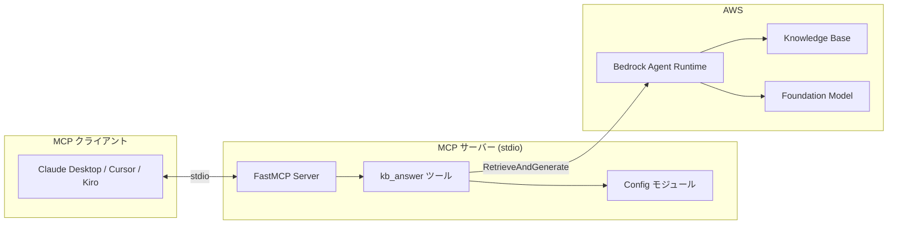

# 設計ドキュメント

## 概要

このドキュメントは、Amazon Bedrock Knowledge Base にクエリを送信する単一の `kb_answer` ツールを公開するミニマルな MCP サーバーの設計を説明します。サーバーは MCP プロトコル処理の簡素化に FastMCP を、AWS API 通信に boto3 を使用します。

## アーキテクチャ



### データフロー

1. MCP クライアントが stdio 経由でツール呼び出しリクエストを送信
2. FastMCP がリクエストを `kb_answer` ハンドラーにルーティング
3. ハンドラーが入力を検証し、設定を読み込む
4. ハンドラーが Bedrock `RetrieveAndGenerate` API を呼び出す
5. レスポンスがパースされフォーマットされる
6. 構造化された結果がクライアントに返される

## コンポーネントとインターフェース

### 1. 設定モジュール (`config.py`)

環境変数の読み込みと検証を担当。

```python
@dataclass
class KBConfig:
    aws_region: str
    kb_id: str
    model_arn: str
    
def load_config() -> KBConfig:
    """環境変数から設定を読み込む。"""
    pass
```

### 2. Bedrock クライアントモジュール (`bedrock_client.py`)

Bedrock Agent Runtime API 呼び出しをカプセル化。

```python
@dataclass
class Citation:
    content: str
    location: dict
    score: float | None

@dataclass
class KBResponse:
    answer: str
    citations: list[Citation]

def query_knowledge_base(
    client: Any,
    config: KBConfig,
    query: str,
    max_results: int = 4
) -> KBResponse:
    """RetrieveAndGenerate API 呼び出しを実行。"""
    pass
```

### 3. MCP サーバーモジュール (`server.py`)

FastMCP ツール登録を含むメインエントリーポイント。

```python
mcp = FastMCP("mcp-bedrock-kb")

@mcp.tool()
def kb_answer(query: str, max_results: int = 4) -> dict:
    """Knowledge Base にクエリを送信し、引用付きの回答を返す。"""
    pass
```

## データモデル

### 入力スキーマ

```json
{
  "query": {
    "type": "string",
    "description": "Knowledge Base に送信する質問"
  },
  "max_results": {
    "type": "integer",
    "default": 4,
    "description": "取得するソースチャンクの最大数"
  }
}
```

### 出力スキーマ

```json
{
  "answer": {
    "type": "string",
    "description": "Knowledge Base から生成された回答"
  },
  "citations": {
    "type": "array",
    "items": {
      "type": "object",
      "properties": {
        "content": { "type": "string" },
        "location": { "type": "object" },
        "score": { "type": "number", "nullable": true }
      }
    }
  }
}
```

### Bedrock API レスポンス構造

`RetrieveAndGenerate` API は以下を返す：

```python
{
    "output": {"text": "生成された回答..."},
    "citations": [
        {
            "retrievedReferences": [
                {
                    "content": {"text": "ソースチャンク..."},
                    "location": {"s3Location": {...}, "type": "S3"},
                    "score": 0.85
                }
            ]
        }
    ]
}
```

## 正確性プロパティ

*プロパティとは、システムのすべての有効な実行において真であるべき特性または動作です。本質的には、システムが何をすべきかについての形式的な記述です。プロパティは、人間が読める仕様と機械で検証可能な正確性保証の橋渡しをします。*

### プロパティ 1: 設定値の正確な読み込み

*任意の* `AWS_REGION`、`BEDROCK_KB_ID`、`BEDROCK_MODEL_ARN` の有効な環境変数値に対して、設定を読み込むと、それらの値を正確に含む config オブジェクトが生成される。`AWS_REGION` が設定されていない場合、デフォルト値 `ap-northeast-1` が使用される。

**検証対象: 要件 1.1, 1.2, 1.3**

### プロパティ 2: 必須設定欠落時のエラー

*任意の* `BEDROCK_KB_ID` または `BEDROCK_MODEL_ARN` が欠落している環境状態に対して、`load_config()` を呼び出すと、欠落している変数名を含むエラーが発生する。

**検証対象: 要件 1.4**

### プロパティ 3: レスポンスパースで全フィールドを抽出

*任意の* 回答と引用を含む有効な Bedrock `RetrieveAndGenerate` API レスポンスに対して、レスポンスをパースすると以下の `KBResponse` オブジェクトが生成される：
- `answer` フィールドは API レスポンスの `output.text` と等しい
- 各引用は `retrievedReferences` から抽出された `content`、`location`、`score` を含む

**検証対象: 要件 2.2, 2.3, 2.5**

### プロパティ 4: リクエスト構築で全パラメータを含む

*任意の* クエリ文字列と max_results 値に対して、構築された API リクエストは以下を含む：
- 設定された `knowledgeBaseId`
- 設定された `modelArn`
- 提供された max_results 値に設定された `numberOfResults`

**検証対象: 要件 2.1, 2.4**

### プロパティ 5: 空白のみのクエリを拒否

*任意の* 空白文字（スペース、タブ、改行）のみで構成される文字列に対して、`kb_answer` を呼び出すと、Bedrock API を呼び出さずにバリデーションエラーが発生する。

**検証対象: 要件 3.4**

### プロパティ 6: APIエラーで例外詳細を保持

*任意の* Bedrock API 呼び出しで発生した例外に対して、エラーレスポンスは元の例外メッセージまたは型情報を含む。

**検証対象: 要件 3.3**

## エラーハンドリング

### エラーカテゴリ

| エラータイプ | 検出方法 | レスポンス |
|------------|-----------|----------|
| 設定欠落 | 環境変数が未設定 | 変数名を含む `ValueError` を発生 |
| 空クエリ | クエリが空白のみ | バリデーションメッセージを含む `ValueError` を発生 |
| 認証エラー | 認証関連コードの `ClientError` | 認証情報ガイダンスを含むエラーを返す |
| KB 未検出 | ResourceNotFound の `ClientError` | 無効な KB ID を示すエラーを返す |
| ネットワーク/サービス | その他の `ClientError` または `BotoCoreError` | 例外詳細を含むエラーを返す |

### エラーレスポンス形式

```python
{
    "error": True,
    "error_type": "ValidationError" | "AuthenticationError" | "NotFoundError" | "ServiceError",
    "message": "人間が読めるエラー説明"
}
```

## テスト戦略

### プロパティベーステスト

プロジェクトは Python 用のプロパティベーステストライブラリとして **Hypothesis** を使用します。

各プロパティベーステストは以下を満たす必要があります：
- 最低 100 回のイテレーションを実行
- 正確性プロパティを参照するコメントでタグ付け: `**Feature: mcp-bedrock-kb, Property {number}: {property_text}**`
- 入力を有効な範囲に制約するスマートジェネレーターを使用

### ユニットテスト

ユニットテストは以下をカバーします：
- 特定のエラーシナリオ（認証エラー、KB 未検出）
- レスポンスパースのエッジケース（空の引用、欠落フィールド）
- ツールスキーマ登録の検証

### テスト構造

```
tests/
├── test_config.py          # 設定読み込みのプロパティテスト
├── test_response_parser.py # レスポンスパースのプロパティテスト
├── test_request_builder.py # リクエスト構築のプロパティテスト
├── test_validation.py      # 入力バリデーションのプロパティテスト
└── test_errors.py          # エラーハンドリングのユニットテスト
```

### 依存関係

- `pytest` - テストランナー
- `hypothesis` - プロパティベーステスト
- `pytest-mock` - boto3 クライアントのモック
